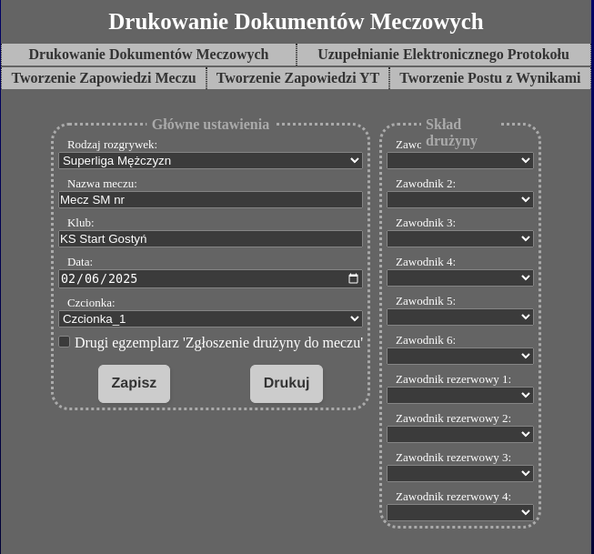
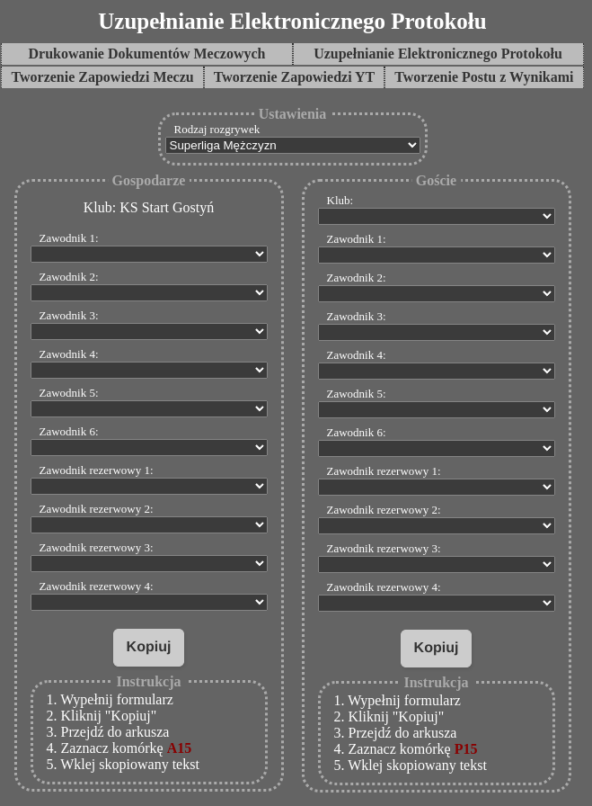
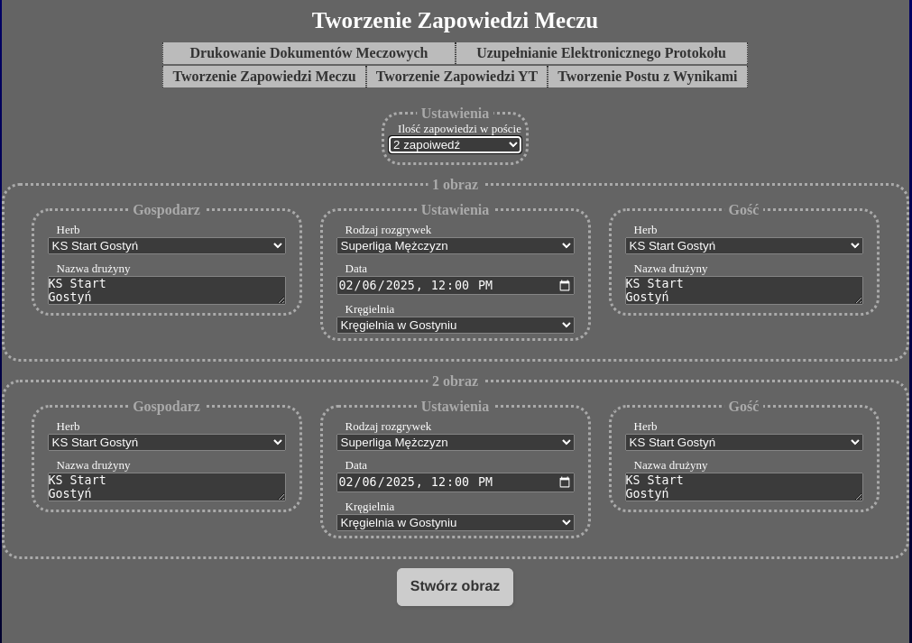
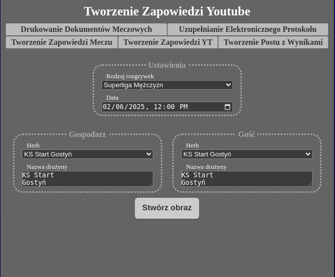
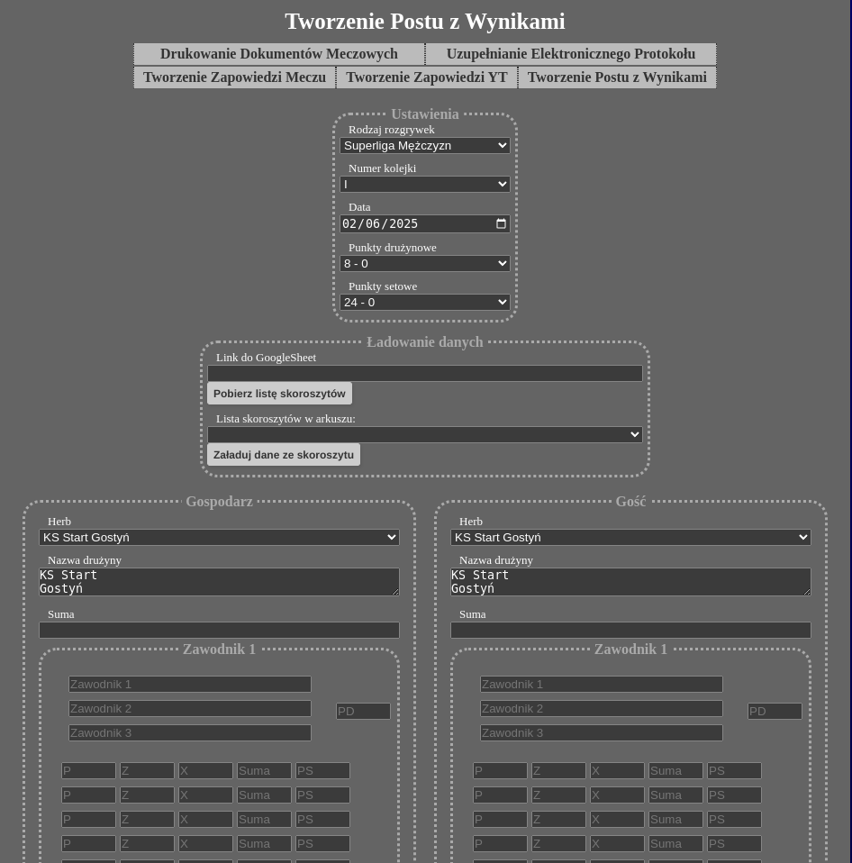
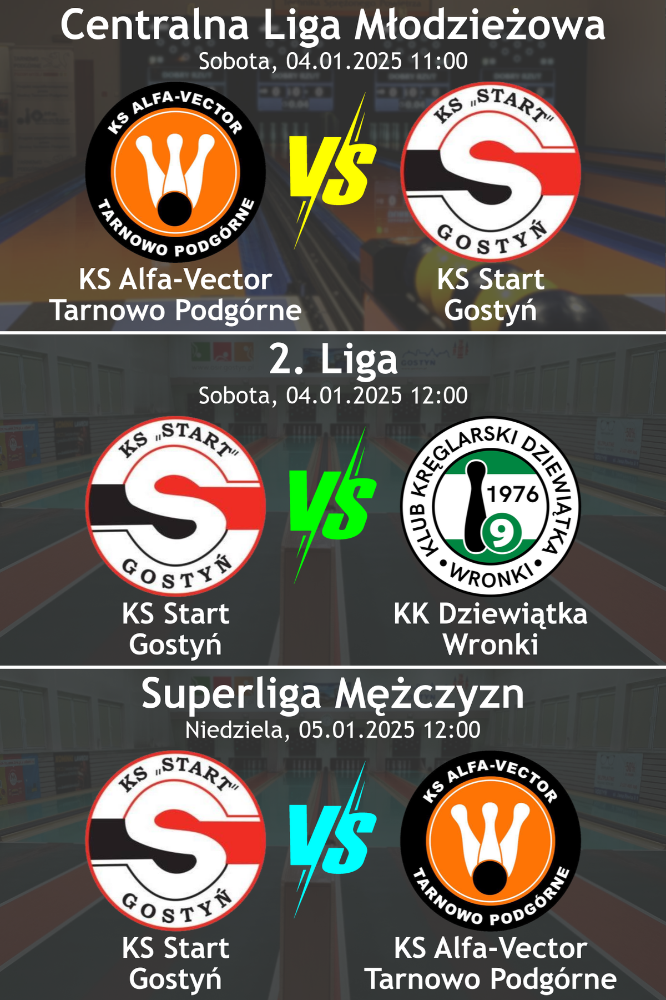
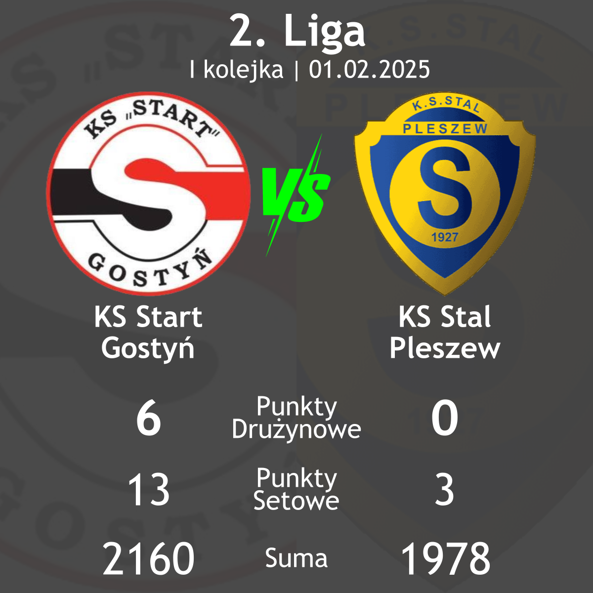

# Narzędzia Kręglarskie

Projekt zawiera zestaw narzędzi do wspierania organizacji i zarządzania meczami kręglarskimi. Obejmuje funkcje takie jak:

- Tworzenie zapowiedzi meczów kręglarskich.
- Generowanie podsumowań meczów.
- Tworzenie plansz początkowych do transmisji.
- Wypełnianie dokumentów do wydruków.
- Pomoc w wypełnianiu formularza meczowego.

Projekt został napisany w **Next.js** (wersja 13.4.19) z wykorzystaniem **Node.js** (wersja 18.20.6) i **npm** (wersja 10.8.2).

---

## Wymagania systemowe

- Node.js 18.x
- npm 10.x
- pm2 5.3.0 (opcjonalnie, do uruchamiania demona)

---

## Instalacja

1. Sklonuj repozytorium:
   ```bash
   git clone https://github.com/patlukas/nextjs-ninepin-league-tools
   cd nextjs-ninepin-league-tools
   ```

2. Zainstaluj zależności:
   ```bash
   npm install
   ```

---

## Uruchamianie projektu

Oczywiście! Oto zaktualizowana sekcja w pliku `README.md` dotycząca konfiguracji klucza API do Google Sheets:

---

## Konfiguracja środowiska

Aby umożliwić odczytywanie danych z Google Sheets, należy skonfigurować klucz API w pliku `.env.local`.

1. **Utwórz plik `.env.local`** w głównym katalogu projektu, jeśli go jeszcze nie ma:
   ```bash
   touch .env.local
   ```

2. **Dodaj klucz API Google Sheets** do pliku `.env.local`:
   ```env
   API_KEY=twój_klucz_api
   ```
   - `twój_klucz_api` to klucz API uzyskany z [Google Cloud Console](https://console.cloud.google.com/).
   - Upewnij się, że klucz ma uprawnienia do odczytywania danych z Google Sheets.

---


### Tryb developerski (lokalny)
Aby uruchomić projekt w trybie developerskim, użyj:
```bash
npm run dev
```
Aplikacja będzie dostępna pod adresem: `http://localhost:3000`.

---

### Budowanie projektu
Aby zbudować projekt, uruchom:
```bash
npm run build
```

---

### Uruchamianie produkcji
Po zbudowaniu projektu możesz go uruchomić w trybie produkcyjnym:
```bash
npm run start
```

---

### Uruchamianie z użyciem PM2
Jeśli hosting nie obsługuje bezpośredniego uruchamiania, możesz użyć **PM2** do zarządzania procesem:

1. Zarezerwuj port (np. `59844`) w pliku `ecosystem.config.js`, przykładowa zawartość pliku:
   ```javascript
   module.exports = {
     apps: [
       {
         name: 'narzedzia-kreglarskie',
         script: 'npm',
         args: 'start',
         env: {
           PORT: 59844, // Zmień na inny port, jeśli potrzebujesz
           NODE_ENV: 'production',
         },
       },
     ],
   };
   ```

2. Uruchom aplikację za pomocą PM2:
   ```bash
   pm2 start
   ```

3. Sprawdzenie logów błędów:
   ```bash
   pm2 logs --err --lines 50
   ```

4. Lista uruchomionych demonów:
   ```bash
   pm2 list
   ```

---

## Funkcje projektu

### 1. Tworzenie zapowiedzi meczów
- Generuj obrazy z zapowiedziamu meczów kręglarskich.
- Dostosuj format i treść do swoich potrzeb.

### 2. Podsumowania meczów
- Automatycznie generuj podsumowania meczów na podstawie wyników.
- Eksportuj podsumowania obrazów

### 3. Plansze początkowe do transmisji na żywo
- Twórz plansze początkowe do live.
- Dostosuj zawartość plansz.

### 4. Wypełnianie dokumentów
- Automatycznie wypełniaj dokumenty do wydruków
- Eksportuj dokumenty do formatu PDF.

### 5. Pomoc w wypełnianiu formularza meczowego
- Uprość proces wypełniania formularzy meczowych.
- Wprowadzaj dane szybko i bez błędów.

---

## Zrzuty ekranu
### Wygląd aplikacji:







### Generowane obrazy:

#### Zapowiedź meczów


#### Podsumowanie meczu
